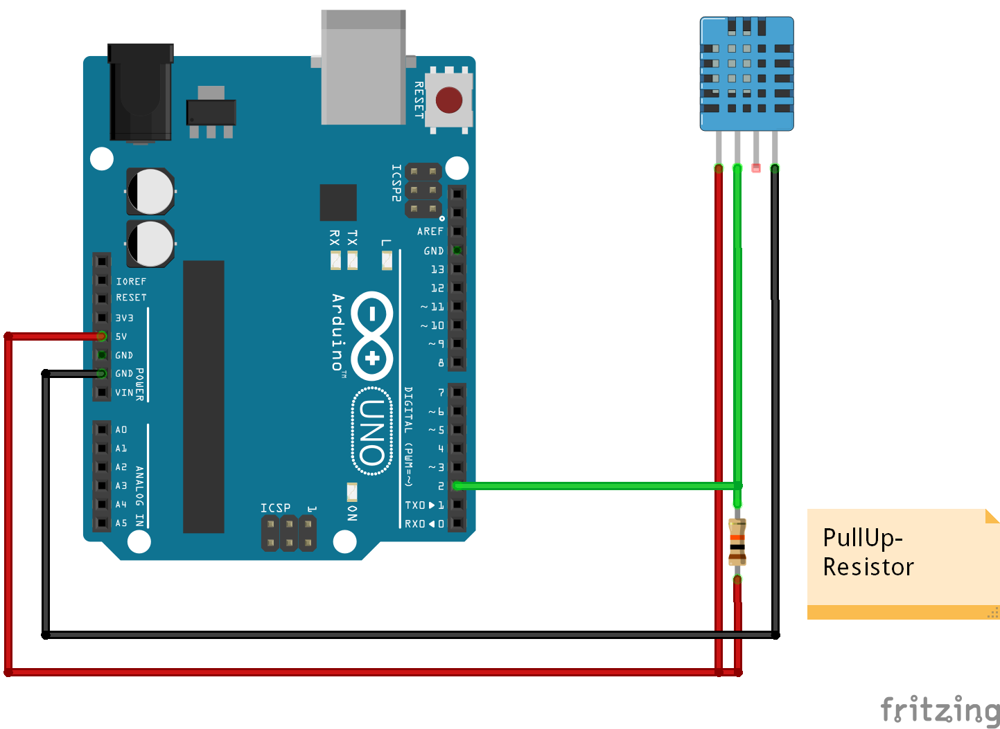

# Setting Up Arduino
## Setting up IDE
* Anweisungen auf [Arduino.cc](https://www.arduino.cc/en/Guide/HomePage) befolgen
* Aktuell kommt ein Arduino Uno R3 zum Einsatz

* Arduino ensprechend zusammenbauen

## Verwendete Bibliotheken
* [ArduionoJson](https://github.com/bblanchon/ArduinoJson)
